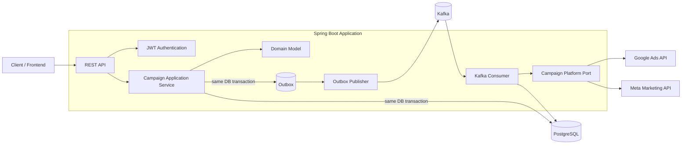
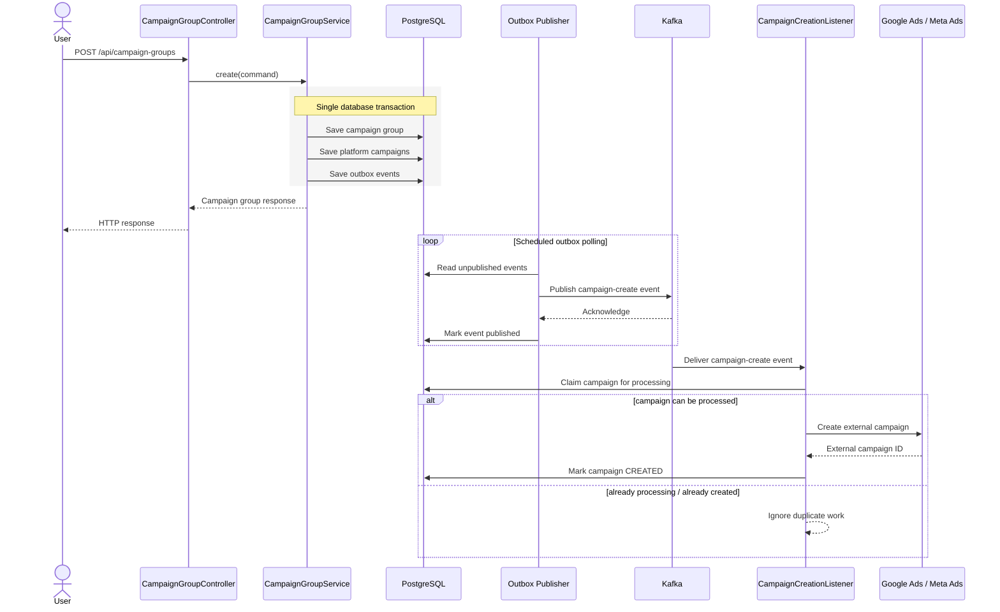
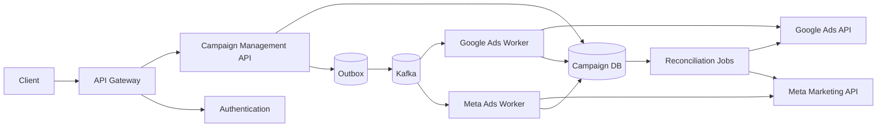

# Digital Advertising Management

A backend system for managing advertising campaigns across multiple external advertising platforms from a single domain model.

The project focuses on the engineering problems behind cross-platform campaign orchestration: transactional consistency, asynchronous processing, retries, duplicate delivery, external API failures, authentication, database migrations, and keeping platform-specific code outside the core business logic.

---

## Why this project exists

Advertising platforms such as Google Ads and Meta Ads expose different APIs, data models, failure modes, credentials, and operational constraints.

A naive implementation could call each advertising API directly from an HTTP request:

```text
Client
  |
  v
Application
  |
  +----> PostgreSQL
  |
  +----> Google Ads
  |
  +----> Meta Ads
```

That approach couples request latency and availability to third-party systems. It also creates a consistency problem:

1. the local database transaction succeeds;
2. the external API call fails, times out, or the application crashes;
3. local and external state diverge.

This project instead treats external campaign provisioning as an **asynchronous workflow**.

The current implementation uses:

- a relational domain model in PostgreSQL;
- a transactional outbox for reliable hand-off from database state to messaging;
- Kafka for asynchronous campaign provisioning;
- retryable consumers for transient external-platform failures;
- idempotency / processing claims to reduce duplicate work;
- platform ports and adapters to isolate Google Ads and Meta Ads integrations;
- JWT-based authentication;
- Flyway-managed schema migrations.

---

## High-level architecture



The important boundary is between the application/domain layers and external advertising platforms. The core workflow depends on a `CampaignPlatformClient` abstraction instead of Google- or Meta-specific SDK classes.

---

## Campaign creation flow

A campaign group can target one or more advertising platforms. The application creates one internal campaign per selected platform and records an outbox event for each campaign.



---

## Transactional outbox

### The problem

Saving application state and publishing a Kafka event are operations against two different systems.

This is unsafe:

```text
BEGIN DATABASE TRANSACTION
    save campaign
COMMIT

publish Kafka event
```

If the process crashes after the database commit but before the Kafka publish, the campaign exists locally but is never provisioned externally.

### Current approach

`CampaignGroupService#create(...)` creates:

- the campaign group;
- the individual platform campaigns;
- their outbox events;

inside one Spring `@Transactional` operation.

Conceptually:

```text
BEGIN
    INSERT campaign_group
    INSERT campaign(s)
    INSERT outbox_event(s)
COMMIT
```

The HTTP transaction therefore does **not** depend on Kafka being available at that exact moment.

A scheduled `OutboxEventPublisher` later loads unpublished events in batches and publishes them to the `campaign-create` Kafka topic.

Current publisher characteristics:

- polls every **1 second**;
- reads up to **100** unpublished events per batch;
- uses the campaign aggregate ID as the Kafka message key;
- marks successfully published events as published.

### Delivery semantics

The publisher deliberately favors **at-least-once delivery** over pretending to provide exactly-once behavior across PostgreSQL, Kafka, and third-party advertising APIs.

There is an unavoidable failure window:

```text
Kafka publish succeeds
        |
        v
process crashes
        |
        v
outbox row was not marked published
        |
        v
event may be published again
```

Therefore consumers must tolerate duplicate delivery.

That is why idempotency is treated as part of the application design rather than as a Kafka configuration detail.

---

## Idempotent campaign processing

`CampaignCreationService` attempts to claim a campaign before calling an external advertising platform.

Conceptually:

```text
message received
      |
      v
tryMarkProcessing(campaignId)
      |
      +---- false ----> another worker already owns it / work already completed
      |
     true
      |
      v
load campaign
      |
      +---- external ID already exists ----> reconcile local state
      |
      v
call external platform
      |
      +---- success ----> store external ID + mark CREATED
      |
      +---- failure ----> mark FAILED + rethrow
```

This protects the worker from straightforward duplicate Kafka deliveries and concurrent processing.

It also makes processing state explicit instead of assuming that receiving a Kafka message means it has only ever been delivered once.

---

## Retry strategy

External advertising APIs are network dependencies. Temporary failures should not immediately become permanent campaign failures.

The Kafka listener currently uses Spring Kafka retry topics with:

- **4 attempts**;
- **2 second** initial delay;
- exponential multiplier of **2**;
- maximum delay of **10 seconds**;
- listener concurrency of **5**.

This keeps retry behavior outside the synchronous HTTP request path.

A failed platform call is also reflected in local campaign state, including a bounded failure reason, before the exception is rethrown for retry processing.

---

## External platform integrations

### Google Ads

The Google Ads adapter implements the common `CampaignPlatformClient` port and uses the official Google Ads Java SDK.

The integration is conditionally enabled with:

```properties
google.ads.enabled=true
```

This allows the application to run without activating the Google integration in environments where credentials are not configured.

### Meta Ads

The Meta adapter also implements `CampaignPlatformClient` and uses the Meta/Facebook Java Business SDK.

Both platform implementations live under infrastructure code rather than leaking platform SDK types into the domain model.

That separation is intentional:

```text
Application / Domain
        |
        v
CampaignPlatformClient
        |
        +---- GoogleAdsCampaignClient
        |
        +---- MetaAdsCampaignClient
```

Adding another platform should primarily require a new adapter rather than rewriting campaign orchestration.

---

## Architecture style

The campaign module is organized around domain/application boundaries rather than a flat controller-service-repository structure.

```text
campaignmanagement/
├── api/
│   ├── controller/
│   ├── dto/
│   └── exception/
│
├── application/
│   ├── command/
│   ├── exception/
│   ├── messaging/
│   ├── port/
│   ├── result/
│   └── service/
│
├── domain/
│   ├── exception/
│   ├── model/
│   └── repository/
│
└── infrastructure/
    ├── integration/
    ├── messaging/
    └── persistence/
```

### Responsibilities

| Layer | Responsibility |
|---|---|
| `api` | HTTP transport, request validation, response mapping |
| `application` | use cases, orchestration, commands/results, ports |
| `domain` | campaign concepts, state and repository abstractions |
| `infrastructure` | JPA persistence, Kafka, serialization, external SDK adapters |

The goal is to keep business workflow decisions independent from transport, persistence, and vendor SDK details.

---

## Main technologies

| Area | Technology |
|---|---|
| Language | Java 21 |
| Framework | Spring Boot |
| HTTP API | Spring Web / REST |
| Authentication | Spring Security + JWT |
| Persistence | Spring Data JPA / Hibernate |
| Database | PostgreSQL 16 |
| Database migrations | Flyway |
| Messaging | Apache Kafka |
| Google integration | Google Ads Java SDK |
| Meta integration | Meta/Facebook Java Business SDK |
| Build | Maven |
| Formatting | Spotless + Google Java Format |
| Local infrastructure | Docker Compose |

---

## Domain model

At a high level:

```text
User
 |
 +---- CampaignGroup
          |
          +---- CampaignConfiguration
          |
          +---- Campaign [GOOGLE]
          |
          +---- Campaign [META]
```

A `CampaignGroup` represents the user's cross-platform advertising intent.

Each external platform receives its own internal `Campaign` so that provisioning status, external IDs, and failures can be tracked independently.

This is important because one platform may succeed while another platform temporarily fails.

---

## API

Campaign-group endpoints currently include:

| Method | Endpoint | Purpose |
|---|---|---|
| `POST` | `/api/campaign-groups` | Create a campaign group and platform campaigns |
| `GET` | `/api/campaign-groups` | Paginated list for the authenticated user |
| `GET` | `/api/campaign-groups/{id}` | Fetch campaign-group details |

Campaign resources are scoped to the authenticated user rather than accepting an arbitrary owner ID from the request.

### Example conceptual request

The exact DTO may evolve, but a campaign-group creation request represents data similar to:

```json
{
  "name": "Autumn Acquisition Campaign",
  "platforms": ["GOOGLE", "META"],
  "configuration": {
    "objective": "TRAFFIC",
    "budgetType": "DAILY",
    "budgetAmount": 100,
    "startDate": "2026-09-15",
    "endDate": "2026-10-15"
  }
}
```

> Check the current DTO/enums in the source before copying this example into an API client; this section is intended as a readable overview of the domain contract.

---

## Design & Architectural Patterns

The project uses patterns where they solve concrete architectural problems rather
than applying patterns for their own sake.

### Hexagonal Architecture / Ports & Adapters

The core application does not depend directly on Google Ads or Meta SDKs.

`CampaignPlatformClient` defines the application port:

    Application
         |
         v
CampaignPlatformClient
|
+----+----+
|         |
Google     Meta
Adapter    Adapter

This keeps vendor-specific APIs in the infrastructure layer and allows new
advertising platforms to be introduced without changing campaign orchestration.

### Strategy Pattern

Google Ads and Meta Ads campaign creation represent interchangeable strategies
behind `CampaignPlatformClient`.

The appropriate strategy is selected using the target `AdPlatform`.

### Registry / Resolver Pattern

`CampaignPlatformClientResolver` receives all available platform clients and
registers them by `AdPlatform`.

This avoids conditional logic such as:

    if (platform == GOOGLE) ...
    else if (platform == META) ...

Adding another platform primarily requires registering another
`CampaignPlatformClient` implementation.

### Repository Pattern

Persistence is accessed through repository abstractions rather than directly
from application services.

This keeps persistence details outside the domain/application workflow and
makes use cases easier to test.

### Transactional Outbox Pattern

Campaign state and integration events are stored in the same database
transaction.

A separate publisher later forwards unpublished events to Kafka.

This avoids the classic dual-write failure:

    database commit succeeds
             |
             X application crashes
             |
       Kafka publish lost

### Polling Publisher Pattern

`OutboxEventPublisher` periodically scans the outbox for unpublished events
and publishes them to Kafka.

Successful messages are then marked as published.

### Idempotent Consumer Pattern

Kafka provides at-least-once delivery, so duplicate messages are possible.

Before performing an external side effect, campaign processing attempts an
atomic state claim through `tryMarkProcessing()`.

This prevents ordinary duplicate deliveries or competing workers from
executing the same campaign operation simultaneously.

### Retry with Exponential Backoff

Transient failures from advertising APIs are retried asynchronously through
Kafka retry handling.

Backoff prevents continuously hammering an unavailable external service.

### Event-Driven Architecture

The HTTP layer persists campaign intent rather than synchronously provisioning
campaigns on third-party platforms.

Kafka events trigger the external campaign creation workflow asynchronously.

This decouples API availability and latency from Google Ads and Meta Ads.

### Dependency Inversion

Application services depend on abstractions such as:

- `CampaignPlatformClient`
- domain repository interfaces

Infrastructure components implement those contracts.

The dependency direction therefore points toward the application/domain rather
than toward external SDKs and persistence technologies.

## Security

The application uses Spring Security and JWT-based authentication.

JWT settings are externalized:

```properties
app.jwt.secret=${JWT_SECRET}
app.jwt.expiration-ms=${JWT_EXPIRATION_MS:3600000}
```

Secrets are expected to come from the environment rather than being committed into the repository.

Campaign-group APIs use the authenticated principal to determine ownership.

---

## Database migrations

Schema management uses Flyway.

Hibernate is configured with:

```properties
spring.jpa.hibernate.ddl-auto=validate
```

This is intentional.

Hibernate validates that the runtime entity model matches the schema, while schema changes are versioned explicitly through Flyway migrations.

That is preferable to allowing an ORM to mutate a production-style schema implicitly.

---

## Running locally

### Requirements

You need:

- Docker + Docker Compose, or
- Java 21 + Maven + PostgreSQL + Kafka.

The easiest local setup is Docker Compose.

### 1. Clone the repository

```bash
git clone https://github.com/yadigar-mammadov/digital-advertising-management.git
cd digital-advertising-management
```

### 2. Configure environment variables

At minimum, provide a JWT secret.

For example, create a local `.env` file:

```dotenv
JWT_SECRET=replace-with-a-long-random-secret
JWT_EXPIRATION_MS=3600000

# Kafka defaults to the Compose service when not overridden.
KAFKA_BOOTSTRAP_SERVERS=kafka:9092

# Google Ads
GOOGLE_ADS_ENABLED=false
GOOGLE_ADS_CLIENT_ID=
GOOGLE_ADS_CLIENT_SECRET=
GOOGLE_ADS_REFRESH_TOKEN=
GOOGLE_ADS_DEVELOPER_TOKEN=
GOOGLE_ADS_LOGIN_CUSTOMER_ID=

# Meta Ads
META_AD_ACCOUNT_ID=
META_ACCESS_TOKEN=
META_APP_SECRET=
```

Never commit real credentials.

### 3. Start the stack

```bash
docker compose up --build
```

The Compose stack currently includes:

- Spring Boot application;
- PostgreSQL 16;
- Apache Kafka.

Application port:

```text
http://localhost:8080
```

PostgreSQL:

```text
localhost:5432
```

Kafka:

```text
localhost:9092
```

### 4. Stop the stack

```bash
docker compose down
```

To also remove local database volumes:

```bash
docker compose down -v
```

---

## Running without Docker

If PostgreSQL and Kafka are already available locally:

```bash
./mvnw spring-boot:run
```

You will need to provide the corresponding datasource, Kafka, JWT, and advertising-platform environment configuration.

---

## Build and quality checks

Compile/package:

```bash
./mvnw clean package
```

Run tests:

```bash
./mvnw test
```

Run formatting validation:

```bash
./mvnw spotless:check
```

Apply formatting:

```bash
./mvnw spotless:apply
```

Spotless is configured with Google Java Format, unused-import removal, and wildcard-import prevention.

---

## Failure scenarios considered

The project is designed around failure cases rather than only the happy path.

### 1. Database succeeds but Kafka is unavailable

**Handled by:** transactional outbox.

The campaign and outbox event are committed together. Publication can happen later when Kafka becomes available.

### 2. Kafka receives an event more than once

**Handled by:** campaign processing claim / state transition.

A worker attempts to claim processing before performing the external side effect.

### 3. External API temporarily fails

**Handled by:** retryable Kafka processing with exponential backoff.

### 4. One advertising platform fails while another succeeds

**Handled by:** independent campaign records per platform.

The system does not need to treat a cross-platform campaign group as one indivisible external transaction.

### 5. Outbox publish succeeds but marking the row published fails

**Expected behavior:** duplicate publication is possible.

The design assumes at-least-once delivery and pushes duplicate safety into consumer processing.

---

## Important remaining failure window

There is still a harder distributed-systems case worth addressing explicitly:

```text
worker calls external advertising API
              |
              v
external campaign is created
              |
              v
application process dies before external ID is persisted
```

After restart, the local database may not know that the external side effect already happened.

A robust production solution requires a platform-aware strategy such as:

- provider-supported idempotency keys, where available;
- deterministic external identifiers;
- reconciliation jobs that query the provider;
- a dedicated external-operation state machine;
- storing request/correlation metadata before making the call.

This is intentionally documented rather than hidden behind an "exactly once" claim.

---

## Design decisions

### Why Kafka?

Campaign provisioning performs network calls to third-party APIs and should not determine HTTP request latency or availability.

Kafka gives the workflow:

- asynchronous execution;
- retryable consumption;
- consumer concurrency;
- decoupling between persistence and external side effects;
- room for additional consumers as the system evolves.

### Why PostgreSQL?

Campaign groups, campaigns, ownership, configurations, statuses, and outbox records are strongly related transactional data.

The creation workflow specifically benefits from atomic relational transactions.

### Why a transactional outbox?

Because a database commit and Kafka publish cannot be treated as one ordinary local ACID transaction.

The outbox converts the dangerous dual-write problem into:

1. one local database transaction;
2. an asynchronous, retryable publication process.

### Why ports and adapters around advertising platforms?

Google Ads and Meta expose different SDKs and concepts.

Depending directly on those SDK types from application/domain code would make platform behavior spread across the codebase.

The platform port gives the orchestration layer one stable contract.

### Why not call Google/Meta directly from the controller?

Because third-party API latency, throttling and outages would then become HTTP latency, throttling and outages.

Persisting intent first and executing the side effect asynchronously gives the system a recoverable state.

### Why Flyway + Hibernate validation?

Schema evolution should be explicit and reviewable.

Flyway owns migrations; Hibernate validates the mapping instead of silently changing the database.

---

## Current trade-offs

This repository deliberately starts as a modular Spring Boot application instead of prematurely splitting every concern into its own deployable microservice.

That gives:

- simple local development;
- straightforward transactional boundaries;
- fewer distributed components;
- clear module boundaries that can later be extracted if scaling or organizational needs justify it.

Potential extraction should be driven by real boundaries and operational requirements, not by a desire to maximize the number of services.

---

## Observability

The application currently uses structured application logging around important asynchronous operations such as campaign creation and outbox publication.

A production-hardening phase should add:

- Spring Boot Actuator;
- Micrometer metrics;
- Prometheus;
- Grafana dashboards;
- distributed tracing / OpenTelemetry;
- correlation IDs propagated from HTTP -> outbox -> Kafka -> platform call;
- alerts for outbox backlog, retry exhaustion and failed campaigns.

These are roadmap items, not claimed as completed functionality.

---

## Testing strategy

The repository already contains tests, but the intended test pyramid for this system is:

### Unit tests

Focus on:

- domain state transitions;
- campaign-group creation rules;
- platform client resolution;
- duplicate-processing decisions;
- failure-state behavior.

### Integration tests

High-value integration scenarios include:

- PostgreSQL + Flyway startup;
- transactional creation of campaign + outbox event;
- outbox polling and publication;
- Kafka duplicate delivery;
- retry behavior;
- concurrent campaign claims.

Testcontainers is a strong candidate for PostgreSQL and Kafka integration tests.

### Contract / adapter tests

External-platform adapters should test request mapping separately from the core domain.

Real credentials should never be required for the normal unit-test suite.

---

## Roadmap

The following items would move the repository further toward production readiness:

- [ ] expand integration tests with Testcontainers;
- [ ] add GitHub Actions CI;
- [ ] add Actuator + Micrometer + Prometheus metrics;
- [ ] add OpenTelemetry tracing and correlation IDs;
- [ ] make retry exhaustion / dead-letter behavior explicit and observable;
- [ ] add reconciliation for ambiguous external API outcomes;
- [ ] add stronger platform-specific idempotency guarantees;
- [ ] improve Docker image into a production-style multi-stage build;
- [ ] add health/readiness checks for the application;
- [ ] add API documentation with OpenAPI/Swagger;
- [ ] add architecture decision records (`docs/adr`);
- [ ] add load/concurrency tests around campaign processing;
- [ ] add Kubernetes/Helm deployment only after application-level operational concerns are mature.

---

## Production evolution

If traffic and organizational scale justified decomposition, a future architecture could evolve toward:



That decomposition is **not automatically better** than the current modular application. It becomes useful when independent scaling, deployment ownership, fault isolation or release cadence make the added distributed-system complexity worthwhile.

---

## Repository goals

This project is primarily intended to demonstrate backend engineering decisions around:

- domain modeling;
- Java and Spring Boot;
- transactional boundaries;
- PostgreSQL;
- Kafka;
- asynchronous processing;
- idempotency;
- retries and failure handling;
- third-party API integration;
- authentication and authorization;
- ports-and-adapters architecture;
- database migrations;
- containerized local development.

The goal is not to maximize the number of technologies in the repository.

The goal is to make the trade-offs visible.

---